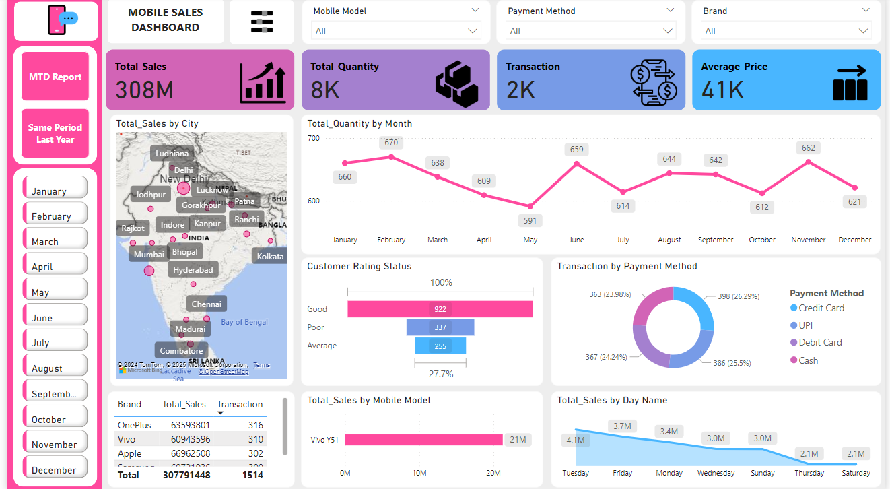
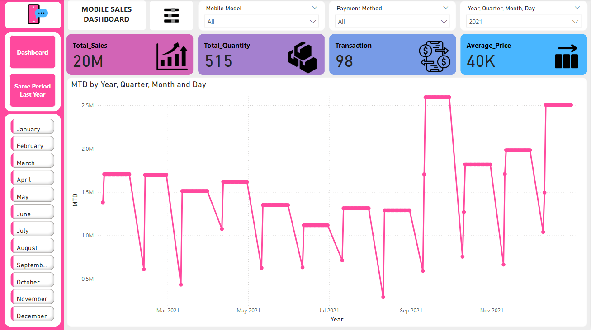
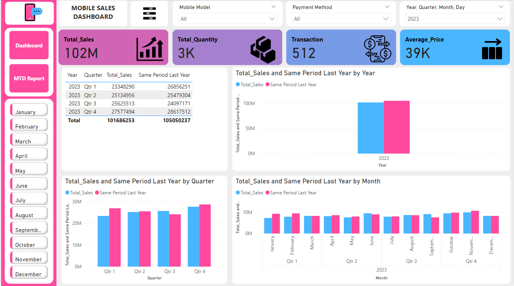

# Power_BI_Dashboard

# **Dashboard Application**

### **Overview**
This is a professional **Power BI Dashboard** designed to provide a clean and organized interface for tracking and managing Key Performance Indicators (KPIs) and other critical metrics. The dashboard focuses on data visualization and advanced filtering to deliver actionable insights.

---

### **Key Features**

1. **KPI Monitoring**
   - Visual representation of essential KPIs for business performance.
   - Provides insights into sales, customer behavior, and operational efficiency.

2. **Data Visualization**
   - Interactive and dynamic graphs, charts, and tables.
   - Real-time updates with a clean and engaging interface.

3. **User-Friendly Design**
   - Minimalistic and intuitive layout for ease of use.
   - Clearly defined sections for better navigation.

4. **Advanced Filtering**
   - Slice and dice your data with powerful filtering options.
   - Focus on specific time periods, regions, or business segments.

5. **Interactive Reports**
   - Drill-down and drill-through capabilities to analyze data at a granular level.
   - Ability to export reports and share insights across teams.

---

### **Key Performance Indicators (KPIs)**

#### 1. **Sales Performance**
   - **Total Sales:** Displays the total revenue generated over a specified period.  
   - **Sales Growth Rate:** Year-over-year or month-over-month growth trends to evaluate business expansion.  
   - **Regional Sales Performance:** A breakdown of sales by region, allowing the identification of top-performing areas.  
   - **Top Products:** Highlights the best-selling products based on sales revenue.  

#### 2. **Customer Insights**  
   - **Customer Satisfaction:** Displays customer ratings or satisfaction metrics from surveys or feedback.  

#### 3. **Operational Metrics**
   - **Inventory Turnover:** Measures how quickly inventory is sold or used in a given time period.  
   - **Cost of Goods Sold (COGS):** Displays the total costs directly associated with production.  
   - **Operational Efficiency Ratio:** Measures overall operational productivity and cost management.  
  
#### 4. **Time-Based Analysis**
   - **Daily, Weekly, Monthly Trends:** Analyzes data trends across different time frames for deeper insights.  
   - **Seasonality Insights:** Helps identify high-performing seasons or months.  

---

### **Screenshots**

#### Dashboard Overview

#### KPI Highlights

#### Real-Time Monitoring

---

### **Technology Stack**
- **Platform:** Power BI  
- **Data Source:** Excel
- **Visualization Tools:** Power BI native visualizations (bar charts, line charts, tables, slicers, etc.)   

---

### **How to Use**
1. Open the Power BI file (.pbix) provided in the repository or shared link.  
2. Connect the data sources Excel.  
3. Interact with the dashboard:
   - Apply filters using slicers or dropdowns.  
   - Click on charts to drill down or focus on specific data.  
4. Publish the dashboard to **Power BI Service** for real-time sharing with your team.  

---

### **Future Enhancements**
- Add predictive analytics for forecasting.  
- Include AI-driven insights for smarter decision-making.  
- Enable more data sources like APIs for real-time data streams.  

---

### **Contact**
For any inquiries or feedback, feel free to contact:  
📧 Email: usama.dev08@gmail.com
